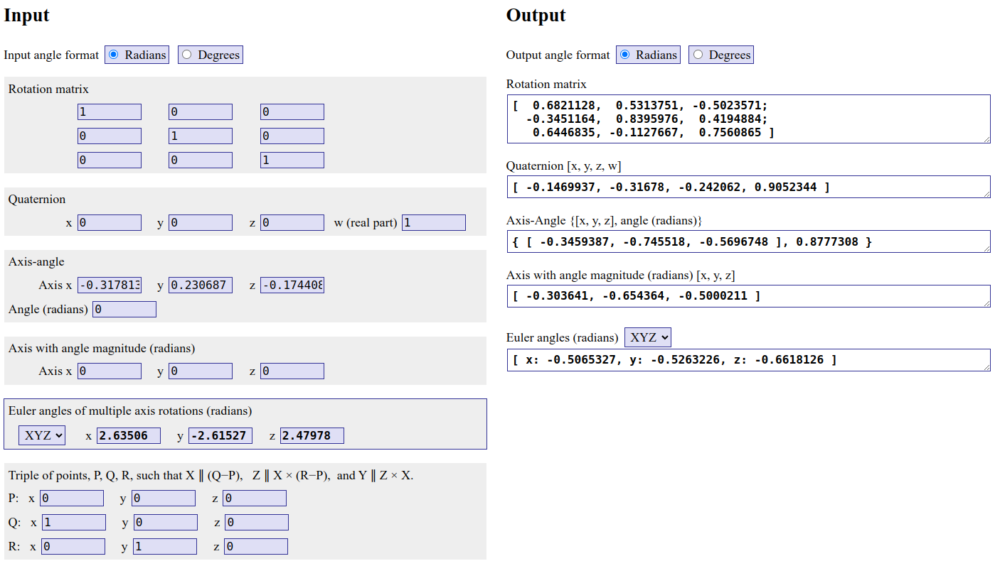
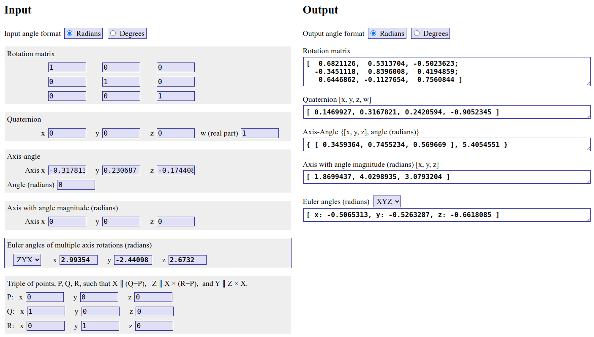
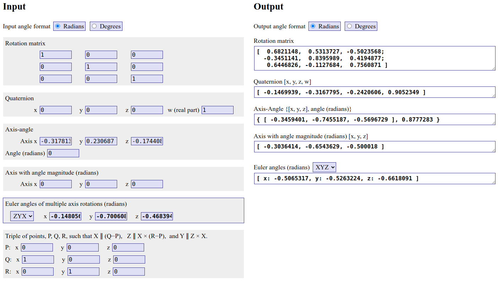

# 3D Rotation Decomposition Study


## Interesting observation

```
// Given rotation matrix
R: [
        0.682115, 0.531373, -0.502357;
        -0.345114, 0.839599, 0.419488;
        0.644683, -0.112768, 0.756087
]
----------------------------------------
// Decomposed angles
[Eigen]  Roll: 2.99354, Pitch: -2.44098, Yaw: 2.6732       // <- zyx
[Eigen]  Roll: 2.63506, Pitch: -2.61527, Yaw: 2.47978      // <- xyz
[OpenCV] Roll: -0.303641, Pitch: -0.654363, Yaw: -0.500018
[GTSAM]  Roll: -0.148056, Pitch: -0.700608, Yaw: -0.468394
[GTSAM]  Roll: -0.148056, Pitch: -0.700608, Yaw: -0.468394 // <- zyx
[Ours]   Roll: -0.148056, Pitch: -0.700608, Yaw: -0.468394 // <- zyx
```

When I generated a rotation matrix using the outputs of the library:

### Eigen with `zyx` style




### Eigen with `xyz` style



### From `R2ypr` function



**Eigen** has larger numerical error! (0.0000025 vs 0.0000002)
